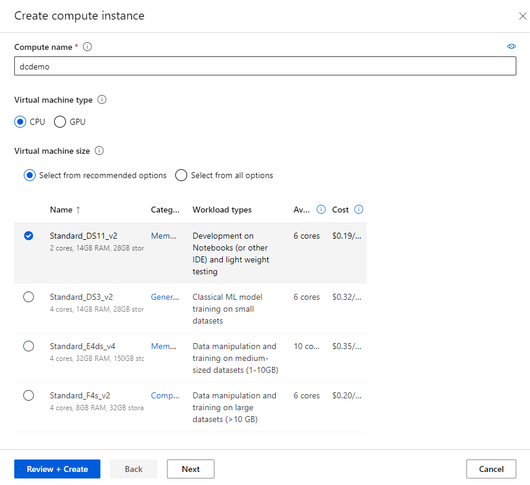
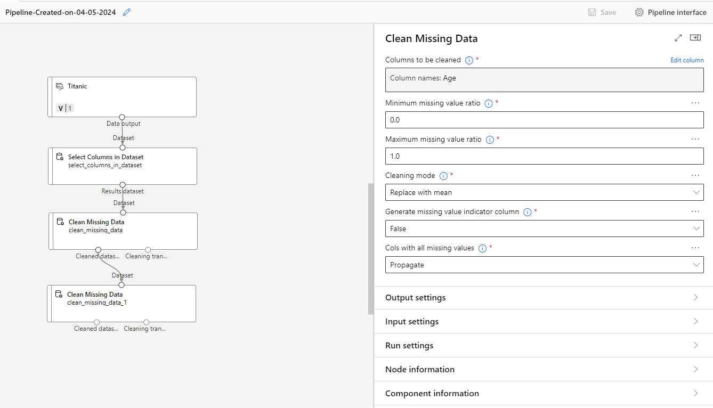

---
lab:
    title: 'Explore Data in Machine Learning'
---
## Module 5: Explore Data in Machine Learning

Before starting this exercise, make sure you have the following prerequisites set up:

### Prerequisites

1. **Azure Machine Learning Resource:** If you haven't already, navigate to [portal.azure.com](https://portal.azure.com) and create an Azure Machine Learning resource. This resource will serve as your workspace for managing machine learning experiments, datasets, and models.

	

1. **Access Azure Machine Learning Studio:** Once your Azure Machine Learning resource is set up, navigate to [ml.azure.com](https://ml.azure.com) to access Azure Machine Learning Studio. Here, you'll be able to perform various machine learning tasks using the visual interface provided by Azure Machine Learning Designer.

	

1. **Compute Target Setup:** Set up a compute target for your Azure Machine Learning workspace. 

**Compute Instances**: Development workstations that data scientists can use to work with data and models.

For this exercise, we recommend using a _Standard_DS11_v2_ compute instance. You can configure this compute target within Azure Machine Learning Studio under the Compute section.

- Compute name: Enter a unique name
- Virtual Machine type: **CPU**
- Virtual Machine size: Choose Select from recommended options
- Search for and select **Standard_DS11_v2**

**Compute Clusters**: Scalable clusters of virtual machines for on-demand processing of experiment code.

- Location: Select the same as your workspace. If that location is not listed, choose the one closest to you
- Virtual Machine priority: Dedicated
- Virtual Machine type: CPU
- Virtual Machine size: 
- Choose Select from recommended options
- Search for and select **Standard_DS11_v2**
- Compute name: Enter a unique name
- Minimum number of nodes: 0
- Maximum number of nodes: 1
- Idle seconds before scale down: 120
- Enable SSH access: Unselected

### Exercise Overview

In this exercise, you'll dive into the Azure Machine Learning Designer feature to explore and preprocess data for machine learning tasks. Using the Titanic dataset, sourced from [here](https://raw.githubusercontent.com/MicrosoftDocs/mslearn-introduction-to-machine-learning/main/Data/titanic.csv), you'll perform the following tasks:

1. **Handling Missing Data:** Explore techniques to identify and handle missing data within the dataset, ensuring robustness and reliability in subsequent analyses.

### Leveraging Azure Machine Learning Designer

Azure Machine Learning Designer offers an intuitive visual interface for building, testing, and deploying machine learning models without writing a single line of code. By leveraging its drag-and-drop functionality, data scientists and analysts can streamline the data preprocessing workflow and gain valuable insights into their datasets.

### Key Learning Objectives

- Understand the importance of data preprocessing in machine learning workflows.
- Explore techniques for handling missing data and predicting missing values.
- Learn how to encode categorical variables using one-hot encoding for machine learning tasks.

### Handling Missing Data

Let's explore techniques to identify and handle missing data within the dataset, ensuring robustness and reliability in subsequent analyses.

1. Load the Titanic dataset into Azure Machine Learning Studio.

	

- Name: Titanic
- Description: Passenger data on the Titanic
- Type: Tabular
- Choose a source for your data asset: From web files
- Web URL: https://raw.githubusercontent.com/MicrosoftDocs/mslearn-introduction-to-machine-learning/main/Data/titanic.csv
- Skip data validation: Not selected
- Settings: Unchanged
- Schema: Unchanged

	

1. Use visualizations and summary statistics to identify missing data points by **creating a new pipeline using classic prebuilt components** in the **Designer** tab.

	

If all is well, you'll see the data asset that you just created in the Designer under the Data tab.

	

Drag the data asset into the Pipeline Interface. From there, you can right click and select preview data as well.

	

You typically apply data transformations to prepare the data for modeling. 
In the pane on the left, expand the **Data Transformation** section, which contains a wide range of modules you can use to transform data before model training.

Drag a **Select Columns in Dataset** module to the canvas, below the **Titanic** module. Then connect the output at the bottom of the **Titanic** module to the input at the top of the Select Columns in Dataset module.

Select the **Select Columns in Dataset** module, and in its **Settings** pane on the right, select **Edit column**. Then in the **Select columns** window, select **By name** and use the + links to add all columns.

	

This being a missing data exercise implies they are missing data. I could tell you (or you could just scroll down to find out), however, let's run the pipeline and see the missing data for yourselves.

To run the pipeline, click the **Configure & Submit** button on the ribbon. 

Basics:
	-	Experiment name: Create new
	-	New experiment name: Enter a unique name
	-	Job display name: Unchanged
	-	Job description: Unchanged
	-	Job tags: Unchanged
Inputs & Outputs: Unchanged
Runtime settings:
	-	Select compute type: Compute cluster
	-	Select Azure ML compute cluster: Previously created
	-	Select datastore: Previously created
	-	Continue on step failure: Selected

At the point, the pipeline will execute. It will take sometime, perhaps, this is a good time for a quick break.

	

It looks like we don't know the age of 177 passengers, and we don't know if two passengers even embarked.

Cabin information for a whopping 687 persons is also missing.

1. Apply appropriate techniques such as imputation or deletion to handle missing data.

There a few ways to handle missing data such assigning the missing data as zero, deleting rows with missing data, replacing empty values with the mean or median for that data, and assigning 

Some datasets may have missing values that appear as zero. While the Titanic dataset doesn't have this problem. You may consider the values of **0** not as 'missing' values, but instead as actual age values. However, it is important to review your raw data.

**Option 1: Delete rows with missing data**

For a model that cannot handle missing data, the most prudent thing to do is to remove rows that have information missing.

Let's remove some data from the `Embarked` column, which only has two rows with missing data using the **Clearn Missing Data** module.

	

**Option 2: Replace empty values with the mean or median for that data**

Sometimes, our model cannot handle missing values, and we also cannot afford to remove too much data. In this case, we can sometimes fill in missing data with an average calculated on the basis of the rest of the dataset. Note that imputing data like this can affect model performance in a negative way. Usually, it's better to simply remove missing data, or to use a model designed to handle missing values.

Here, we impute data for the `Age` field. We use the mean `Age` from the remaining rows, given that >80% of these have values.

	

The `Age` field has no longer has empty cells.

**Option 3: Assign a new category to unknown categorical data**

The `Cabin` field is a categorical field, because the Titanic cabins have a finite number of possible options. Unfortunately, many records have no cabin listed.

For this exercise, it makes perfect sense to create an `Unknown` category, and assign it to the cases where the cabin is unknown.

	

Run the pipeline as an experiment again.

	

That's it! No more missing data!

	

We only lost two records (where `Embarked` was empty).

That said, we had to make some approximations to fill the missing gaps for the `Age` and `Cabin` columns, and those will certainly influence the performance of any model we train on this data.

### Next Steps

After completing this exercise, you'll have gained practical experience in using Azure Machine Learning Designer to preprocess and explore datasets for machine learning tasks. Stay tuned for upcoming modules where we'll delve deeper into advanced data analytics and model development techniques.

Happy exploring!

### Clean Up Resources

If you're not using the Azure resources created in this lab for other training modules, you can delete them to avoid incurring further charges.

1. Open the Azure portal at `https://portal.azure.com`, and in the top search bar, search for the resources you created in this lab.

1. On the resource page, select **Delete** and follow the instructions to delete the resource. Alternatively, you can delete the entire resource group to clean up all resources at the same time.
