---
lab:
    title: 'Custom Object Detection Models'
---
## Module 10: Custom Object Detection Models

### Create an Azure Storage Account
In this unit, you'll use the Azure portal to create a storage account for storing and loading image data for use in training an object detection model using Azure Machine Learning studio.

#### Create an Azure Storage Account
1. Sign in to the [Azure portal](https://portal.azure.com/) using the account that you've prepared for this learning path.

1. On the resource menu, or from the Home page, select the hamburger button in the upper left then select Storage accounts from the drop-down menu. The Storage accounts pane appears.

1. On the command bar, select Create. The Create a storage account pane appears.

1. On the Basics tab, enter the following values for each setting.
- Project details:- 
  - Subscription: *Your Subscription*
  - Resource group: *Create New* OR *Select an Existing Resource Group*
- Instance details:-
  - Storage account name: Enter a unique name. This name will be used to generate the public URL to access the data in the account. The name must be unique across all existing storage account names in Azure. Names must have 3 to 24 characters and can contain only lowercase letters and numbers. Take note of the Storage Account Name as this value will be needed later on when we create a Datastore in Azure Machine Learning Studio.
  - Region: Select a location near to you from the dropdown list.
  - Performance: Standard. This option decides the type of disk storage used to hold the data in the Storage account. Standard uses traditional hard disks, and Premium uses solid-state drives (SSD) for faster access.
  - Redundancy: Select Locally redundant storage (LRS) from the dropdown list. This low-cost option will satisfy our requirements for this learning path, however, you're welcome to choose a different option depending on your individual needs.

1. Select **Next : Advanced**. On the Advanced tab, enter the following values for each setting.
- Security:-
  - Require secure transfer for REST API operations: Check. This setting controls whether HTTP can be used for the REST APIs that access data in the storage account. Setting this option to enable forces all clients to use SSL (HTTPS). Most of the time, you'll want to set secure transfer to enable; using HTTPS over the network is considered a best practice.
  - Enable blob public access: Check. We'll allow clients to read data in that container without authorizing the request.
  - Enable storage account key access: Check. We'll allow clients to access data via SAS.
  - Default to Microsoft Entra authorization in the Azure portal: Uncheck. Clients are public, not part of an Active Directory.
  - Minimum TLS version: Select Version 1.2 from dropdown list. TLS 1.2 is the most secure version of TLS and is used by Azure Storage on public HTTPS endpoints. TLS 1.1 and 1.0 is supported for backwards compatibility. See Warning at end of table.
- Data Lake Storage Gen2:- 
  - Enable hierarchical namespace: Uncheck. Data Lake hierarchical namespace is for big-data applications that aren't relevant to this module.
  - Secure File Transfer Protocol (SFTP): Enable SFTP	Uncheck. SFTP is disabled by default and isn't relevant to this module.
- Blob storage:-
  - Enable network file share: Uncheck (default).
  - Allow cross-tenant replication: Uncheck. Active Directory isn't being used for this exercise.
  - Access tier: Hot. This setting is only used for Blob storage. The Hot access tier is ideal for frequently accessed data; the Cool access tier is better for infrequently accessed data. This setting only sets the default value. When you create a Blob, you can set a different value for the data. In our case, we want our image data to load quickly, so we'll use the high-performance option for our blobs.
- Azure Files:-
  - Enable large file shares: Uncheck. Large file shares provide support up to a 100 TiB, however this type of storage account can't convert to a Geo-redundant storage offering, and upgrades are permanent.

    > Warning
    > If Enable large file shares is selected, it will enforce additional restrictions, and Azure files service connections without encryption will fail, including scenarios using SMB 2.1 or 3.0 on Linux. Because Azure storage doesn't support SSL for custom domain names, this option cannot be used with a custom domain name.

1. Select **Next : Networking**. On the Networking tab, enter the following values for each setting.
- Network connectivity:- 
  - Connectivity method: Public endpoint (all networks). We want to allow public Internet access. Our content is public facing, and we need to allow access from public clients.
- Network routing:-
  - Routing preference: Microsoft network routing. We want to make use of the Microsoft global network that is optimized for low-latency path selection. 

1. Select **Next : Data protection**. On the Data protection tab, enter the following values for each setting.
- Recovery:-
  - Enable point-in-time restore for containers: Uncheck. Not necessary for this implementation.
  - Enable soft delete for blobs: Check. Soft delete lets you recover blob data in cases where blobs or blob snapshots are deleted accidentally or overwritten.
  - Enable soft delete for containers: Check. Soft delete lets you recover your containers that are deleted accidentally.
  - Enable soft delete for file shares: Check. File share soft delete lets you recover your blob data more easily at the folder level.
- Tracking:- 
  - Enable versioning for blobs: Uncheck. Not necessary for this implementation.
  - Enable blob change feed: Uncheck. Not necessary for this implementation
- Access control:-
  - Enable version-level immutability support: Uncheck. Not necessary for this implementation.

1. Select **Next : Encryption**. Accept the defaults.

1. Select **Next : Tags**. Here, you can associate key/value pairs with the account for your categorization to determine if a feature is available to selected Azure resources.

1. Select **Review + create** to validate your options and to ensure all the required fields are selected. If there are issues, this tab will identify them so you can correct them.

1. When validation passes successfully, select Create to deploy the storage account.

1. When deployment is complete, which may take up to two minutes, select **Go to resource** to view **Essential** details about your new storage account.

    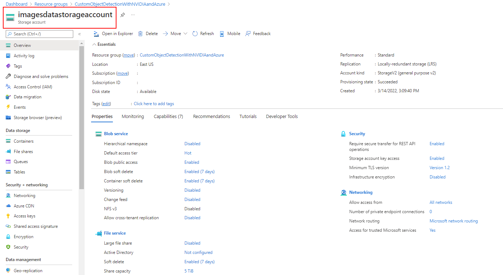

Take note of the Storage Account Name as this value will be needed later on when we create a Datastore in Azure Machine Learning Studio.

### Create an Azure Storage Container
Now that we have an Azure Storage Account, we'll create a container that will allow us to store unstructured blob data. This format is ideal for storing and serving image data in a distributed fashion. We'll reference this data in upcoming steps when we create a Datastore in Azure Machine Learning studio.

#### Create an Azure Storage Container
1. In the Azure portal, navigate to the Azure Storage Account that was created in the previous unit.

1. In the left menu, scroll to the Data Storage section, then select Containers.

    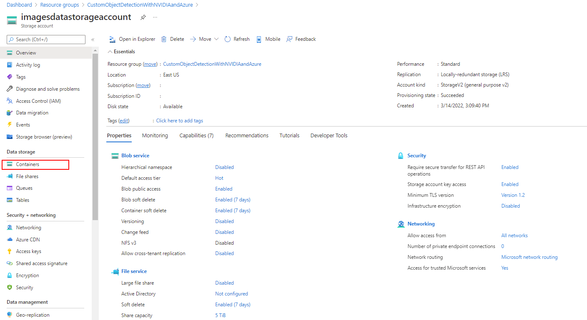

1. Select the + Container+ Button, you'll be prompted to provide a name for your container. You'll want to keep track of this name is a secure and accessible document as it will be referenced later in the module. The container name must be lowercase, must start with a letter or number, and can include only letters, numbers, and the dash (-) character.

    Set the level of public access to the container. The default level is Private (no anonymous access).

    Select Create to create the container:

    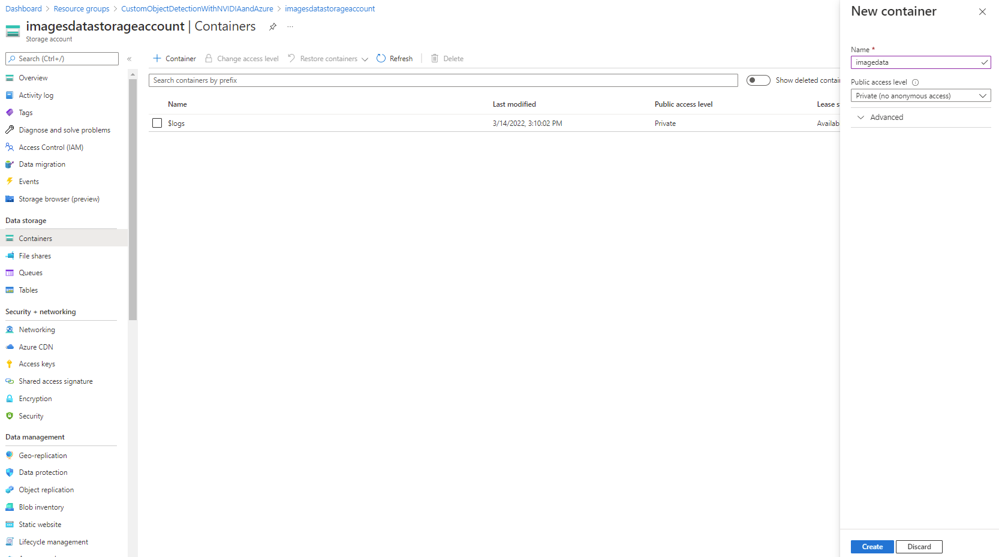

1. Once the container is created, select Access Keys under the Security + networking section of the left-side panel.

    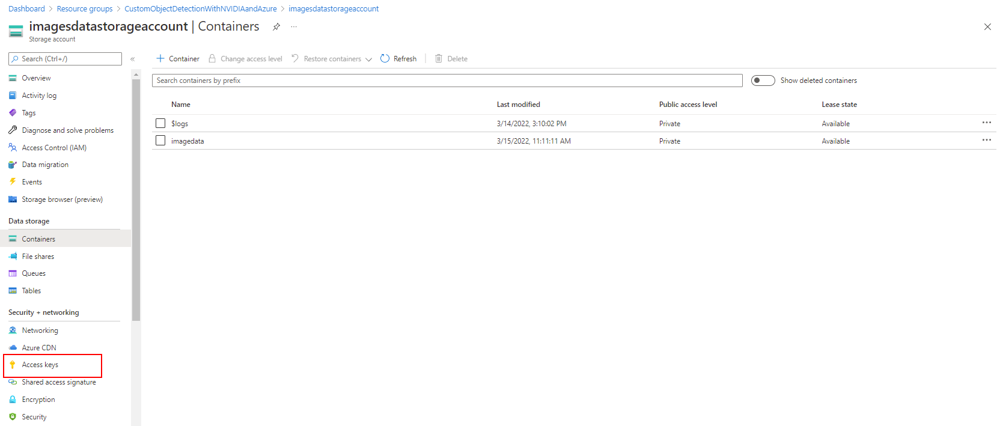

1. This will bring up the following screen. Select the Show keys icon and copy the key to the clipboard and then record it somewhere safe and accessible. This key will be needed later.

    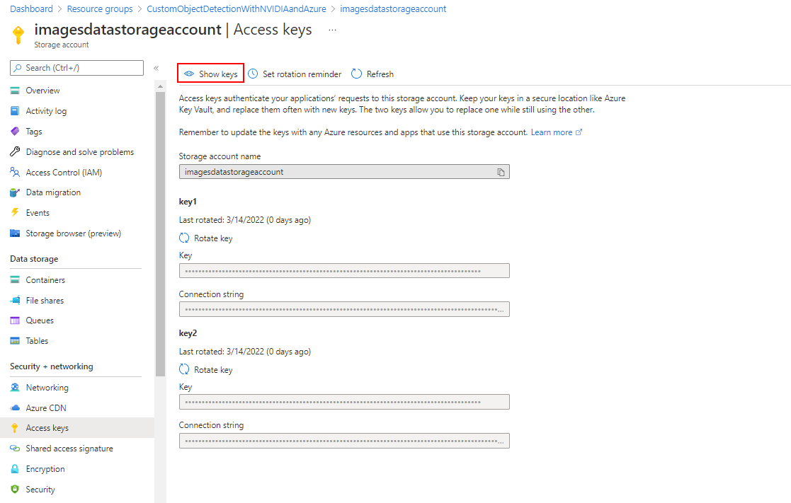

1. Select the Containers section on the left-side panel and select the newly created container as highlighted below:

    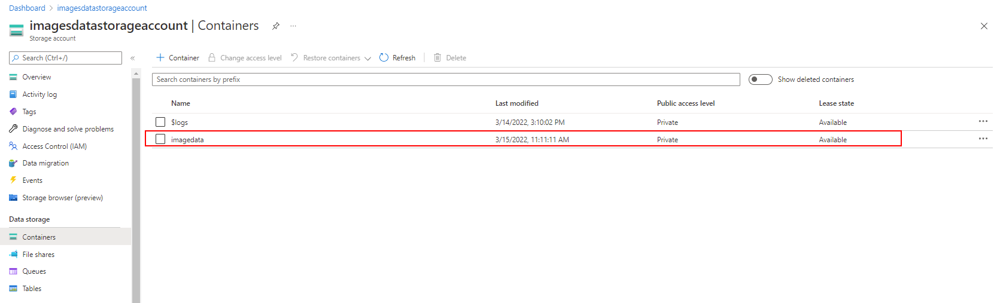

1. Download and extract the following provided image data. You'll need to decompress the included [soda_data_compressed.zip](https://github.com/microsoft/Develop-Custom-Object-Detection-Models-with-NVIDIA-and-Azure-ML-Studio/raw/main/soda_data_compressed.zip) file, then follow the steps in the image below to upload the contents of the _soda_data\train_img_ directory as shown. Once you have selected these files for inclusion, select the now highlighted Upload button to begin the transfer from your machine to the Azure Storage Container.

    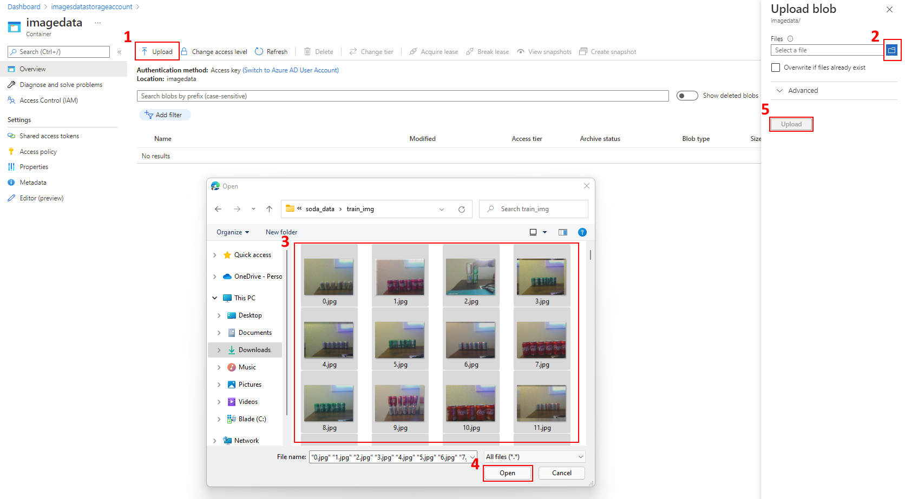

1. Once completed, you should see that 245 images have been added to the Azure Storage Container (0.jpg - 244.jpg). *Note that at a minimum you'll need at least 10 images to train an AutoML for Images model in Azure Machine Learning studio*

    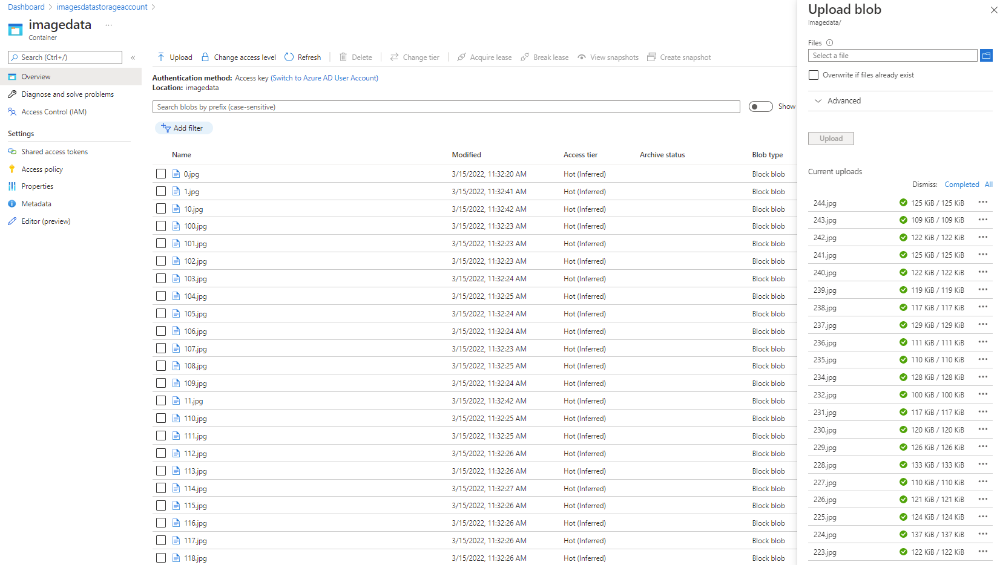

1. At this point, you should have noted the Storage Account Name, Blob Container Name, and Access Key. These values will be used in the next section when we create the Azure Machine Learning Workspace.

### Create an Azure Machine Learning Workspace
Azure Machine Learning is a cloud service for accelerating and managing the machine learning project lifecycle. Machine learning professionals, data scientists, and engineers can use it in their day-to-day workflows: Train and deploy models and manage Machine Learning Ops.

You can create a model in Azure Machine Learning or use a model built from an open-source platform, such as Pytorch, TensorFlow, or scikit-learn. Machine Learning Ops support can help you monitor, retrain, and redeploy models.

There are many advantages of using the Azure Machine Learning platform to create computer vision models, these include:

An Enterprise grade platform service that facilitates the following capabilities when training and deploying CV models:
- A single platform to label, train and deploy models
- Scalability the ability to execute the code for the model training on one compute while the real training of the model happens on another compute that is scalable to align with the number of images and modeling tasks.
- Using the hyperdrive functionality of AutoML for images, it's possible to train hundreds of models using different algorithms and hyperparameters and then automatically have AML determine the best (champion) model automatically.

Learn more about [Machine Learning on Azure](https://azure.microsoft.com/services/machine-learning/#product-overview).

#### Create an Azure Machine Learning Workspace
1. Sign into the [Azure portal](https://portal.azure.com/) by using the credentials for your Azure subscription.

1. In the upper-left corner of the Azure portal, select the three bars, the **+ Create a resource**.

    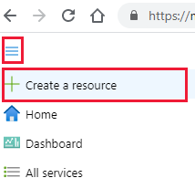

1. Use the search bar to find **machine learning**, then select the **Machine Learning** result:

    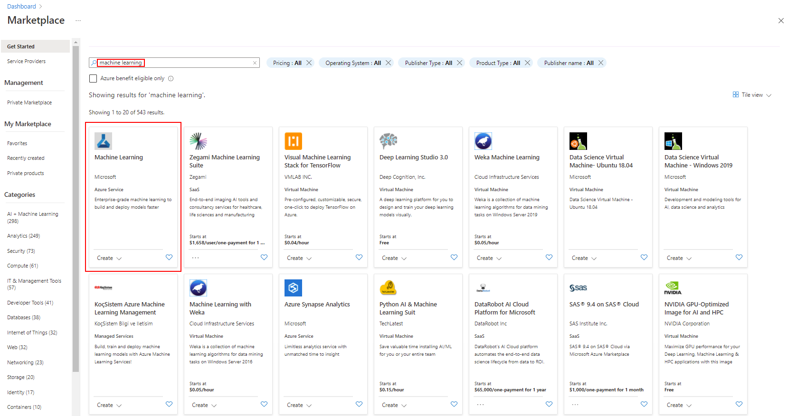

1. In the Machine Learning pane, select the Create button to begin the deployment process:

    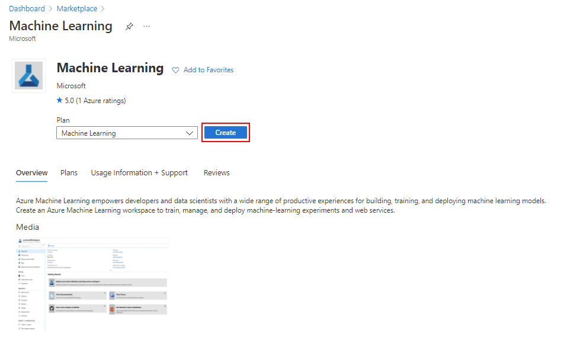

1. On the **Basics** tab, enter the following values for each setting:
- Project details:- 
  - Subscription: *Your Subscription*
  - Resource group: *Create New* OR *Select an Existing Resource Group* (suggested to use the same resource group that contains the Azure Storage Account from previous steps)
- Workspace details:-
  - Workspace name: Enter a unique name, a portion of this value will be used to automatically prefix the names of new resources that will be auto-populated for the settings below.
  - Region: *Select an appropriate region* (suggested to use a location that is in a nearby geography)
  - Storage account: *Create New* (name will be auto-populated using Workspace name prefix)
  - Key vault: *Create New* (name will be auto-populated using Workspace name prefix)
  - Application insights: *Create New* (name will be auto-populated using Workspace name prefix)
  - Container registry: None (This is the default value)

    When you are finished select Review + create to validate the deployment of the Azure Machine Learning workspace.

    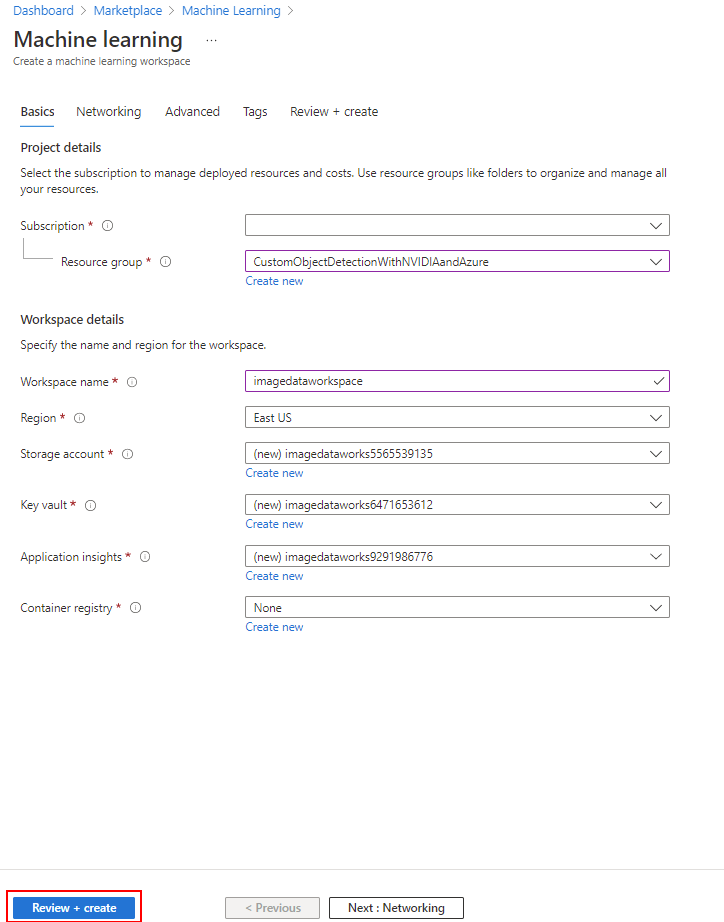

1. On the resulting page you'll be able to validate the details of your deployment. When you're satisfied, select the **Create** button to start the deployment. This process may take a few minutes to complete.

    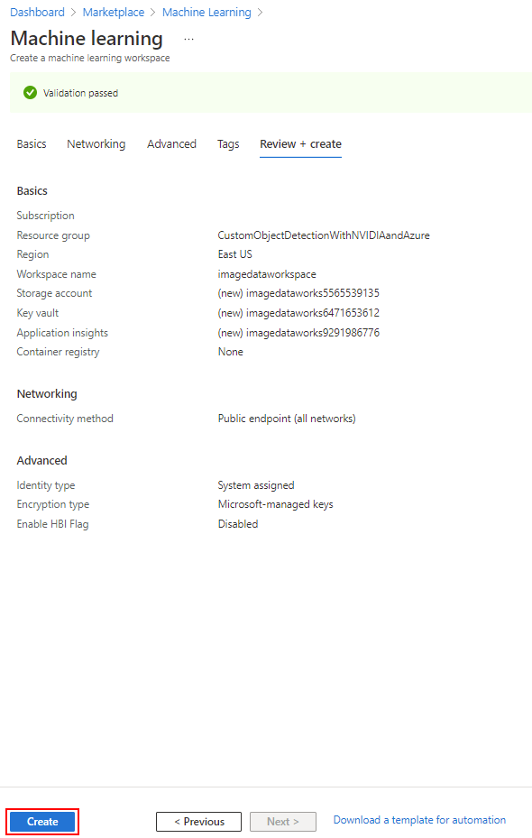

1. Once the deployment has completed, navigate to your new Azure Machine Learning resource. You can easily locate this resource by typing “Azure Machine Learning” in the Azure search bar and choosing the Machine Learning icon. This will list all available Azure Machine Learning resources in your Azure Subscription.

    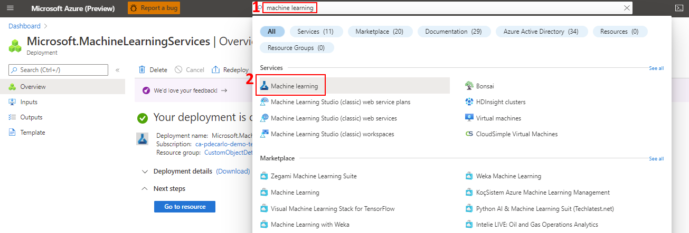

1. When you've successfully navigated to the newly deployed instance, notice in the Overview section there will be a button labeled "Download config.json". Select this button to download the configuration and store it somewhere secure and accessible so that it may be used in the next module.

    

1. While in the Overview section of the Azure Machine Learning workspace resource, select Launch Studio to open your workspace in the browser and prepare for the next unit.

    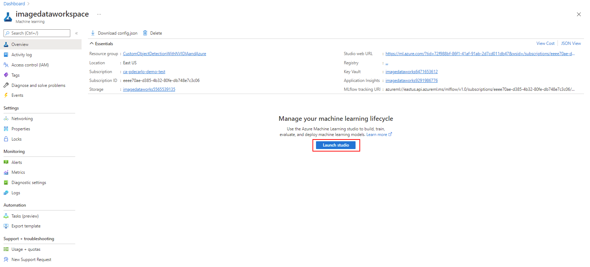

### Create an Azure Machine Learning Compute Instance
In this section, we'll create an online compute resource in Azure Machine Learning that will act as a pre-configured development environment. This environment will provide the ability to execute Python code and run live Jupyter notebooks. We'll refence this development environment in other modules.

#### Create an Azure Machine Learning Compute Instance
1. If you haven't already launched the Azure Machine Learning studio from the Machine Learning Overview mentioned at the end of the previous section, sign in to [Azure Machine Learning studio](https://ml.azure.com/) now, and select your workspace.

1. On the left-hand pane, locate the "Manage" section and select "Compute".

    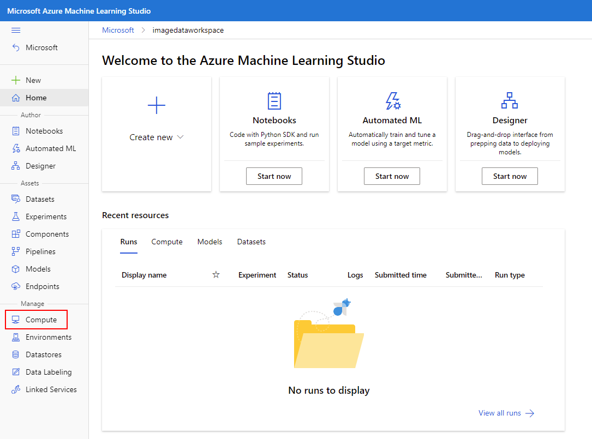

1. On the resulting screen, select **+ New** to create a new compute instance.

    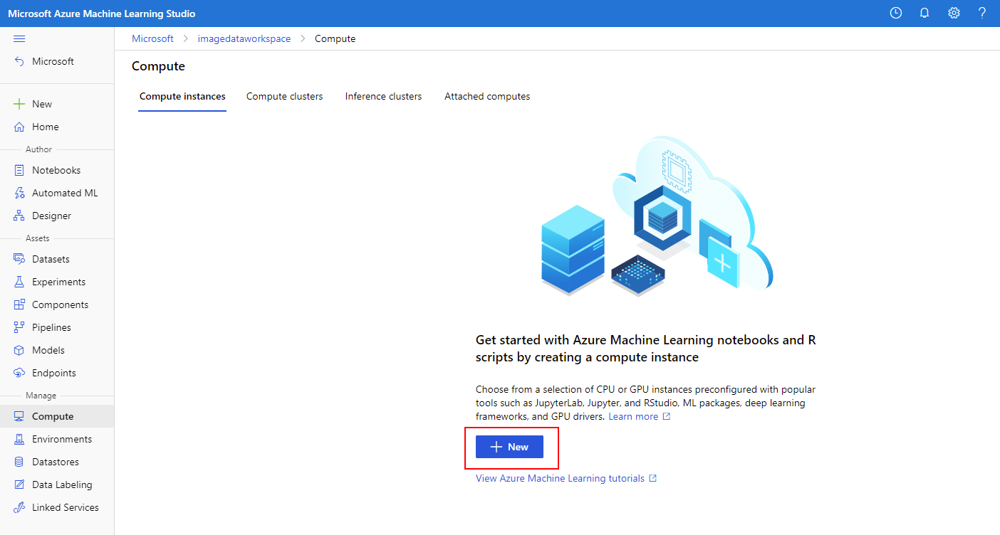

1. In the compute name section, provide a unique value. In the **Virtual machine type** section, select **GPU**. Choose an appropriate machine from the list of populated options (suggested to choose **Standard_NC6**). This instance will execute and train our custom object model using a Jupyter notebook in later steps. When you've provided the appropriate values, select **Create** to begin the deployment of the compute instance.

    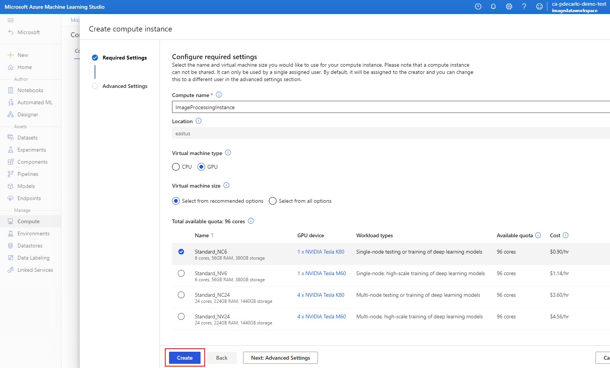

1. The deployment should take a couple minutes to complete, but you're welcome to proceed to the next unit if you don't want to wait. You should notice the State of the instance will eventually change from **Creating** to **Running**. Once in the **Running** state, your compute instance is ready to access and use in upcoming sections of the Learning Path.

    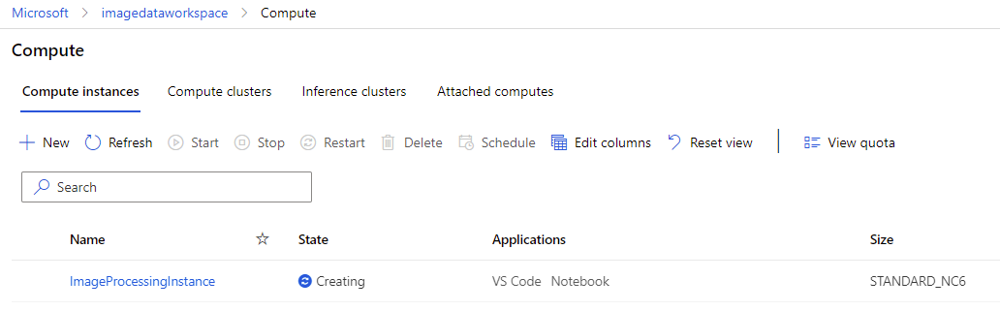

    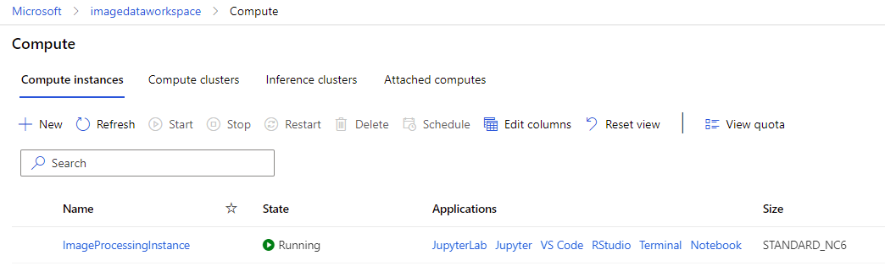

### Create an Azure Machine Learning Datastore
Datastores allow for the ability to securely connect to your storage services in Microsoft Azure without putting your authentication credentials or the integrity of your original data source at risk. They store connection information, like your subscription ID and token authorization in a secure Key Vault that's associated with the Azure Machine Learning workspace. In this way, you can securely access your storage without having to hard code connection information into your scripts. In this section, we'll create a Datastore that will later reference in a Jupyter notebook that will run on our previously deployed compute instance.

#### Create an Azure Machine Learning Datastore
1. If you aren't already launched into the Azure Machine Learning studio that was used in the previous section, sign in to [Azure Machine Learning studio](https://ml.azure.com/) now, and select your workspace.

1. Select Datastores on the left pane under **Manage**

    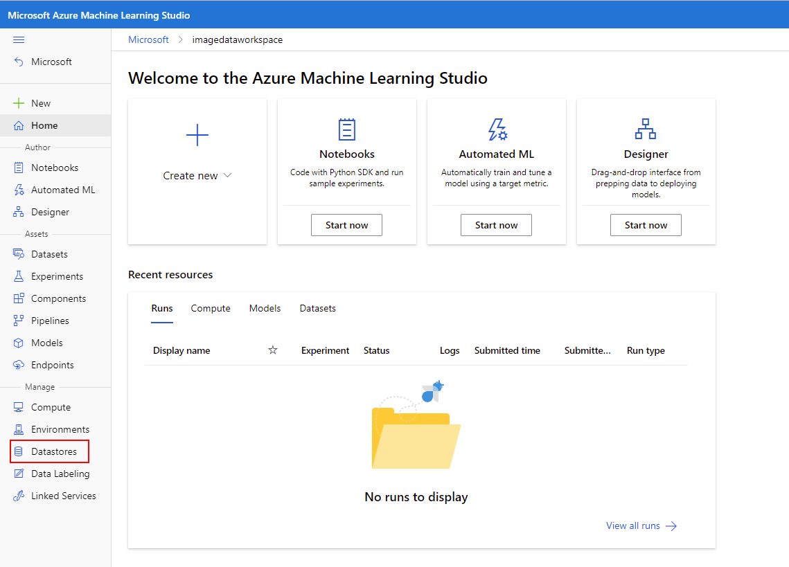

1. Select + New datastore

    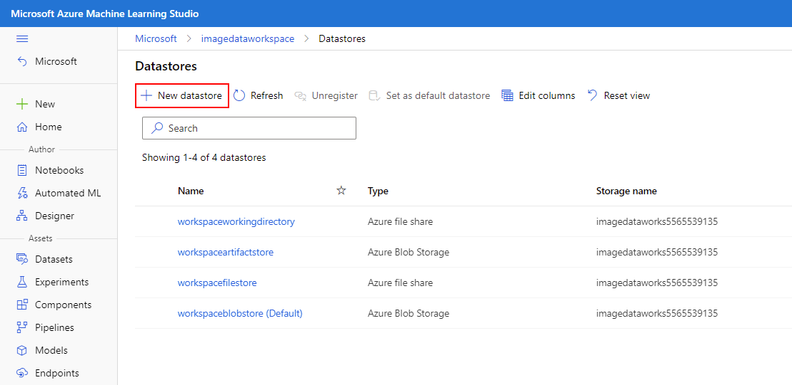

1. Complete the form to create and register a new datastore. The form intelligently updates itself based on your selection for Azure storage type and authentication type. Name the Datastore `computervisionimagesraw`. For Datastore **type**, choose **Azure Blob Storage** and ensure the **From Azure subscription** option is selected. You'll need to reference the values saved previously and select the appropriate **Storage account** and **Blob container** from the respective drop-down. For **Authentication type**, select **Account key** and provide the value of the Access Key used by your storage account. The completed form should look like the following:

    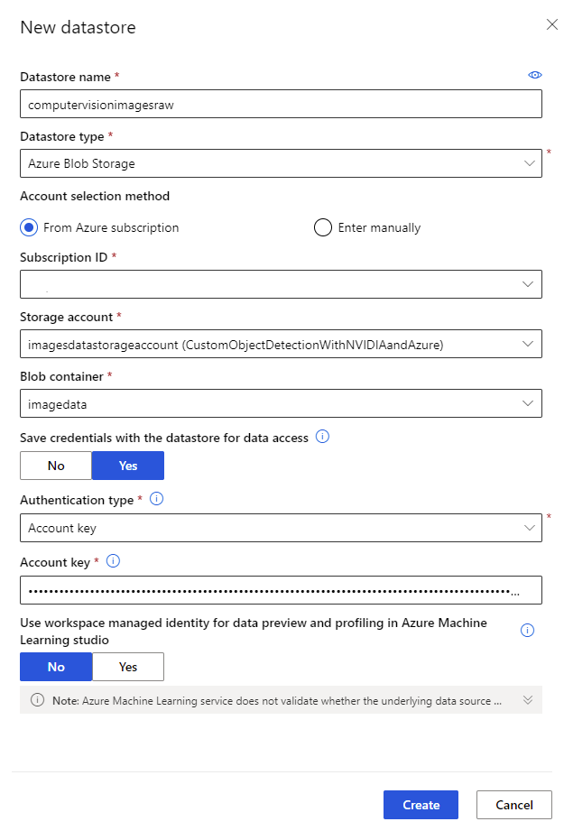

    When you've verified the form information is correct, select Create to create the Datastore.

1. You'll see the newly created Datastore is now populated in the Datastores section of your Azure Machine Learning studio instance.

    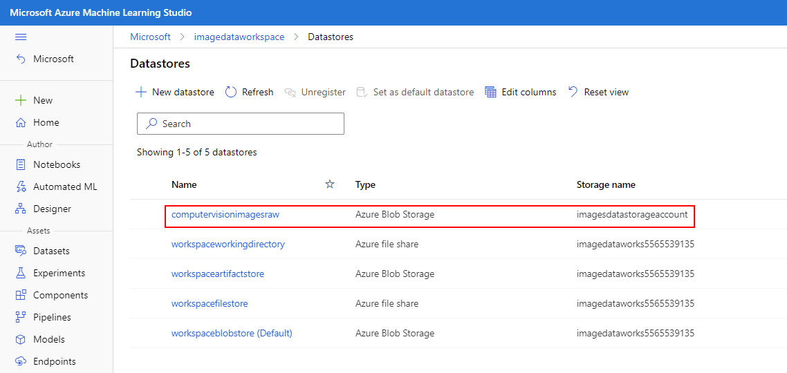
