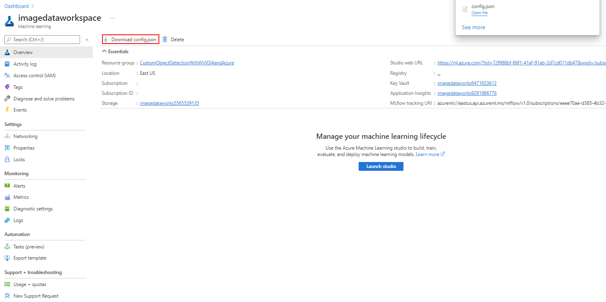
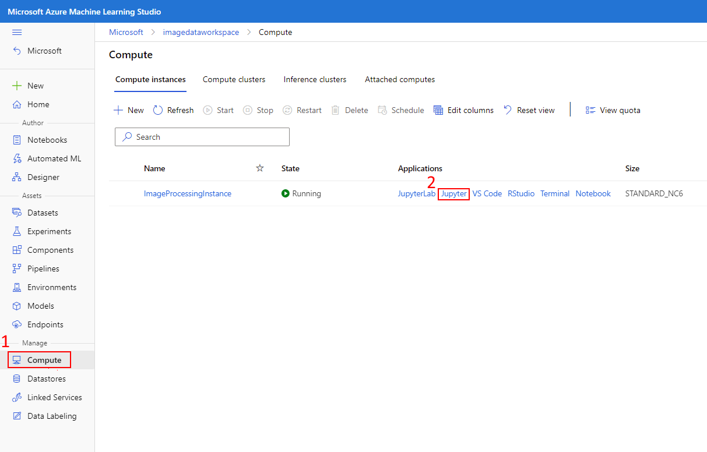
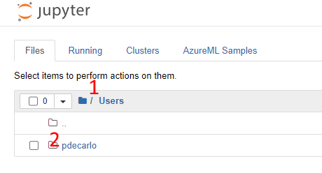
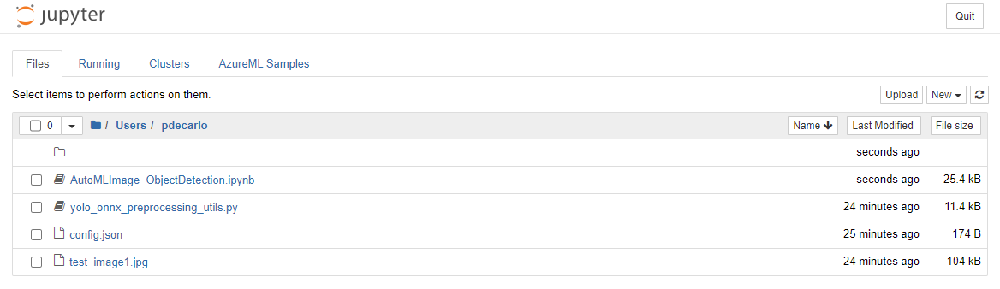

---
lab:
    title: 'Train Production Model'
---
## Module 12: Use AutoML to train a labeled dataset and develop a production model

### Prepare the Jupyter notebook workspace
The Azure Machine Learning compute instance is a secure, cloud-based Azure workstation that provides data scientists with a Jupyter Notebook server, JupyterLab, and a fully managed machine learning environment. Previously we deployed a compute instance that we'll now use to execute a special notebook. This notebook will allow us to train our object detection model using AutoML. In this unit, we'll prepare the Jupyter notebook workspace with prerequisites that will allow us to run the notebook successfully.

#### Prepare the Jupyter notebook workspace
1. Sign in to [Azure Machine Learning studio](https://ml.azure.com/), and select your workspace.

1. If you have already saved and are able to retrieve the config.json file from Module 10, you can skip the next two steps. If you need to obtain this file again, open the [Azure Portal](https://portal.azure.com/) in a new tab and navigate to your Azure Machine Learning resource. You can easily locate this resource by typing “Azure Machine Learning” in the Azure search bar and choosing the Machine Learning icon. This action will list all available Azure Machine Learning resources in your Azure Subscription.

    

1. When you've successfully navigated to your Azure Machine Learning resource, notice in the Overview section there will be a button labeled "Download config.json". Select this button to download the configuration and store it somewhere secure and accessible so that it may be used in upcoming steps.

    

1. On the left-hand pane, locate the **Manage** section and select **Compute**, then select the **Jupyter** link that corresponds to the earlier deployed compute instance.

    

1. Select the **Users** directory, then select your username.

    

1. Download and extract the following provided [Jupyter workspace files](https://github.com/microsoft/Develop-Custom-Object-Detection-Models-with-NVIDIA-and-Azure-ML-Studio/raw/main/jupyter_workspace_compressed.zip). You'll need to decompress the included *jupyter_workspace_compressed.zip* file as the included files will be referenced in the next step.

1. We'll now upload the prerequisite files and create a folder location in our workspace:

    a. Select the **Upload** button (top right) and upload the *config.json* file that was obtained in previous steps (this file isn't included in the .zip file, this file was obtained earlier in the Azure portal and is unique to your account).

    b. Select the *Upload* button (top right) and upload the *test_image1.jpg* file.

    c. Select the *Upload* button (top right) and upload the *yolo_onnx_preprocessing_utils.py* python script.

    d. Select the Upload button (top right) and upload the AutoMLImage_ObjectDetection.ipynb Jupyter notebook.

    The final view of the workspace should look like the following:

    
