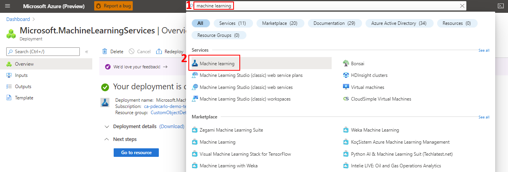

---
lab:
    title: 'Train Production Model'
---
## Module 12: Use AutoML to train a labeled dataset and develop a production model

### Prepare the Jupyter notebook workspace
The Azure Machine Learning compute instance is a secure, cloud-based Azure workstation that provides data scientists with a Jupyter Notebook server, JupyterLab, and a fully managed machine learning environment. Previously we deployed a compute instance that we'll now use to execute a special notebook. This notebook will allow us to train our object detection model using AutoML. In this unit, we'll prepare the Jupyter notebook workspace with prerequisites that will allow us to run the notebook successfully.

#### Prepare the Jupyter notebook workspace
1. Sign in to [Azure Machine Learning studio](https://ml.azure.com/), and select your workspace.

1. If you have already saved and are able to retrieve the config.json file from Module 10, you can skip the next two steps. If you need to obtain this file again, open the [Azure Portal](https://portal.azure.com/) in a new tab and navigate to your Azure Machine Learning resource. You can easily locate this resource by typing “Azure Machine Learning” in the Azure search bar and choosing the Machine Learning icon. This action will list all available Azure Machine Learning resources in your Azure Subscription.

    

1. When you've successfully navigated to your Azure Machine Learning resource, notice in the Overview section there will be a button labeled "Download config.json". Select this button to download the configuration and store it somewhere secure and accessible so that it may be used in upcoming steps.

    

1. On the left-hand pane, locate the **Manage** section and select **Compute**, then select the **Jupyter** link that corresponds to the earlier deployed compute instance.

    

1. Select the **Users** directory, then select your username.

    

1. Download and extract the following provided [Jupyter workspace files](https://github.com/microsoft/Develop-Custom-Object-Detection-Models-with-NVIDIA-and-Azure-ML-Studio/raw/main/jupyter_workspace_compressed.zip). You'll need to decompress the included *jupyter_workspace_compressed.zip* file as the included files will be referenced in the next step.

1. We'll now upload the prerequisite files and create a folder location in our workspace:

    1. Select the **Upload** button (top right) and upload the *config.json* file that was obtained in previous steps (this file isn't included in the .zip file, this file was obtained earlier in the Azure portal and is unique to your account).

    1. Select the *Upload* button (top right) and upload the *test_image1.jpg* file.

    1. Select the *Upload* button (top right) and upload the *yolo_onnx_preprocessing_utils.py* python script.

    1. Select the Upload button (top right) and upload the AutoMLImage_ObjectDetection.ipynb Jupyter notebook.

    The final view of the workspace should look like the following:

    

### Configure the Jupyter notebook execution environment
In this section, we'll work with the Jupyter notebook that was uploaded to our Jupyter workspace. We'll execute commands that will install dependencies to ensure that our environment can run later referenced AutoML tasks. This process will involve upgrading the [azureml Python SDK](https://pypi.org/project/azureml-sdk/) and installing the [torchvision](https://pypi.org/project/torchvision/) Python package.

#### Configure the Jupyter notebook execution environment
1. Navigate to your Jupyter workspace and select the *AutoMLImage_ObjectDetection.ipynb* file to open the Jupyter notebook.

    

1. If you receive a **Kernel not found** prompt, select **Python 3.8 - AzureML** from the dropdown as shown then select Set Kernel.

    

1. Execute the cells in the **Environment Setup** section. This can be done by selecting the cell, then pressing Shift+Enter on the keyboard. Repeat this process for each cell and stop after running `pip install torchvision==0.9.1`.

    

1. After you've successfully executed the **pip install torchvision==0.9.1** task, you'll need to restart the Kernel. To restart the kernel, select the **Kernel** menu item and choose **Restart** from the dropdown.

    

1. Execute the **pip freeze* cell, which will list all installed python libraries, then execute the cell underneath it to import the libraries that will be used in further steps.

1. Continue to execute the cells in the **Workspace setup** section. This step will read in the config.json file that was uploaded earlier and allow us to execute tasks against your Azure Machine Learning workspace.

1. Continue to execute the cells in the **Compute target setup** section. You'll want to change the value of **compute_name** to match the name of the compute instance that exists in your Azure Machine Learning studio workspace. Otherwise, this script may either fail to create the instance (if an instance of the same name already exists in the same region) or it will create a second instance (the subsequent steps will still work but it will not use the existing resource).

    

1. Continue to execute the cells in the **Experiment Setup** section. This will create an Azure machine learning experiment that will allow us to track the status of the model during training.

1. Continue to execute the cells in the **Dataset with input Training Data** section. Please note that you'll need to replace the name variable with the name of the Dataset that was exported at the end of the previous module. This value can be obtained in your Azure Machine Learning studio instance in the left-hand pane, locate the Assets section and select **Datasets**. You can validate that the Dataset was imported properly by viewing the output in the **training_dataset.to_pandas_dataframe()** cell.

    

    

### Execute the Jupyter Notebook to produce an object detection model using AutoML
In this section, we'll continue to work in the Jupyter notebook to execute the steps that will produce our object detection model. This task will be accomplished using [AutoML for computer vision](https://learn.microsoft.com/en-us/azure/machine-learning/concept-automated-ml). You'll be able to see your model in action by performing inference on a test sample that was never before seen by the model during training.

#### Execute the Jupyter Notebook to produce an object detection model using AutoML
1. If you haven't already, navigate to your Jupyter workspace and select the *AutoMLImage_ObjectDetection.ipynb* file to open the Jupyter notebook.

    

1. Continue to the **Configuring your AutoML run for image tasks** section and begin executing the cell in the Using default **hyperparameter values for the specified algorithm**. This step will use an [AutoMLImageConfig](https://learn.microsoft.com/en-us/azure/machine-learning/how-to-auto-train-image-models) to create a model training configuration that will assign default hyperparameters to produce an optimized object detection model.

1. Continue to execute the cells in the **Submitting an AutoML run for Computer Vision Tasks** section. This operation will submit an experiment task that will run on the training instance that was assigned in the **Compute target setup** section. After executing these cells, you can monitor the progress in Azure Machine Learning studio by navigating locating the **Assets** section on the left-hand pane and select **Experiments**.

    

    You can then select the running job, which should be named **automl-image-object-detection_latest_V3**. This action will allow you to view the progress of the model training.

    

1. When the experiment has completed, you'll see the following.

    

    Select the job **Display name** to bring up the job Details where you can view the results of the model training.

    

1. Now that our model is trained, we can continue to execute the cells in the **Register the optimal vision model from the AutoML run** section. This process will automatically select the child run with the highest accuracy.

1. Continue to execute the cells in the **Download the model and other associated files e.g. labels** section. There's an optional cell that you can run by specifying a specific AutoML **run_id**. The output of either of these cells will supply the model and label into a newly created *models* folder that is accessible in your Jupyter workspace. Navigate to your Jupyter workspace and open the *models* folder and you'll see the **labels.json** and **model.onnx** output.

    

    Select **labels.json** and **model.onnx** then **Download** the output files. These files are the trained model and it's associated labels.

    

1. Navigate back to the Jupyter notebook and execute all cells in the **Load the labels and ONNX model files** section. This step will load the model output and labels to prepare for execution.

1. Continue to execute the cells in the **Get expected input and output details for an ONNX model**. This task will analyze the model to determine the input and output shapes that define the Convolution Neural Network present in the model.

1. Continue to execute the cells in the Image Inferencing **Preprocessing** section. This will preprocess the *test_image1.jpg* sample that was uploaded to our workspace earlier. The preprocessing step will transform the image to match the expect input shape that was determined in the previous step.

1. Continue to execute the cells in the **Object detection with YOLO** section. This section will perform inference on the *test_image1.jpg* sample and demonstrate the object detection model output visually in the final cell. Here you can see the accuracy of your model as it detects object on a never before seen image sample.

    
