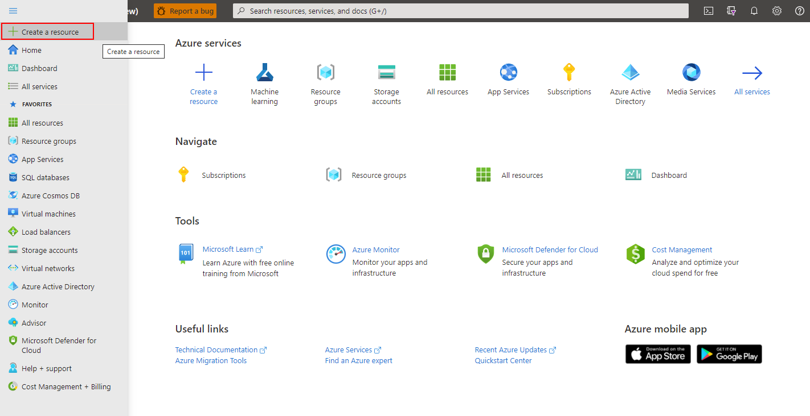
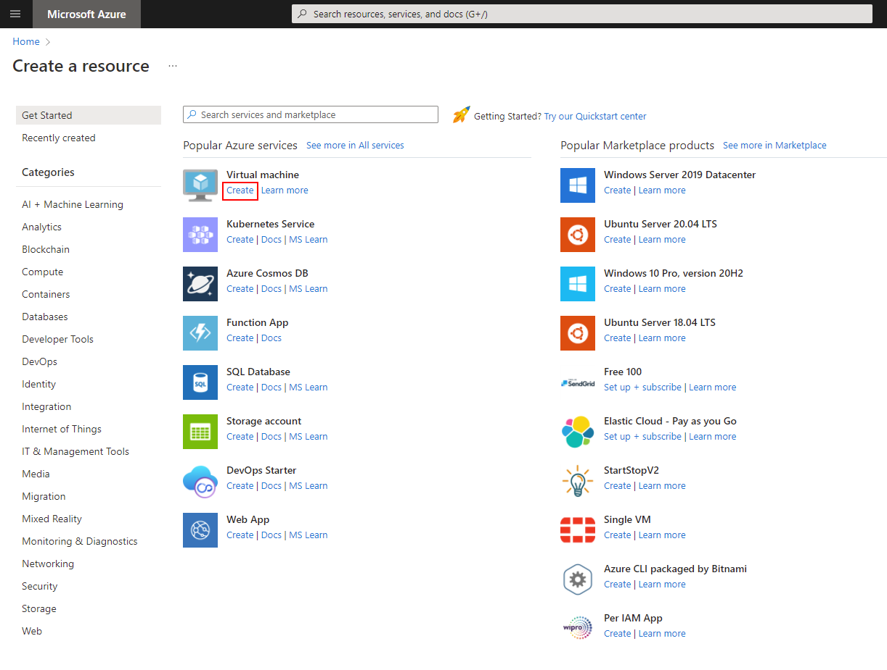
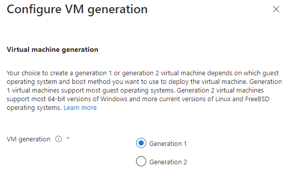
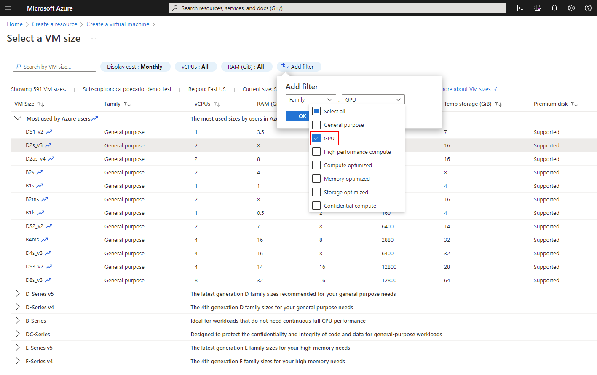
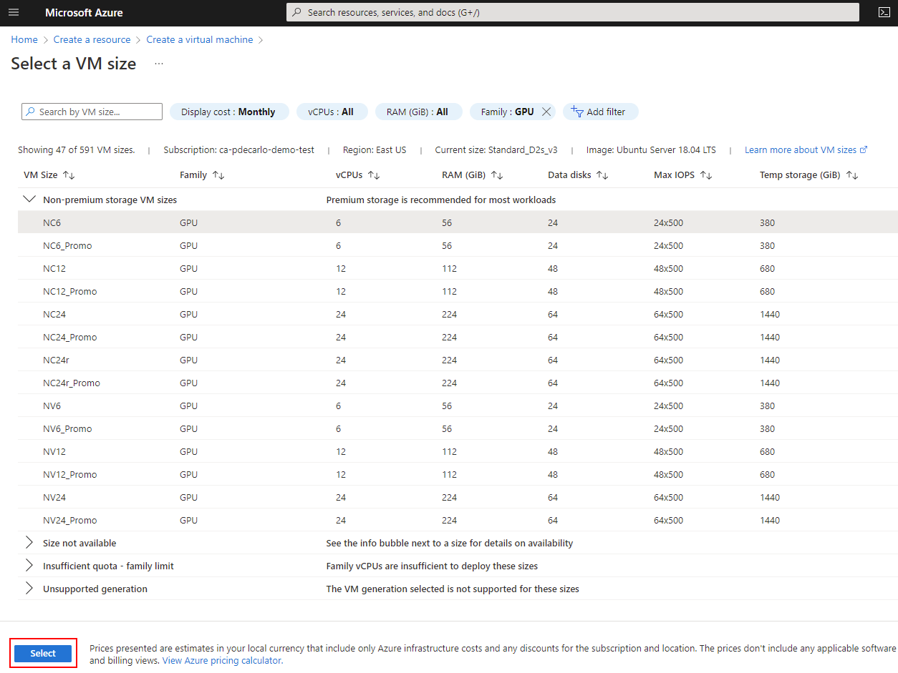
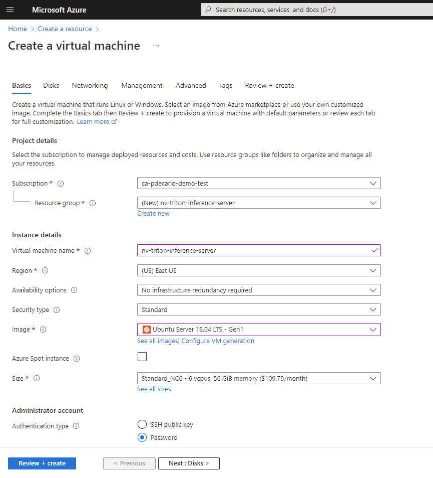
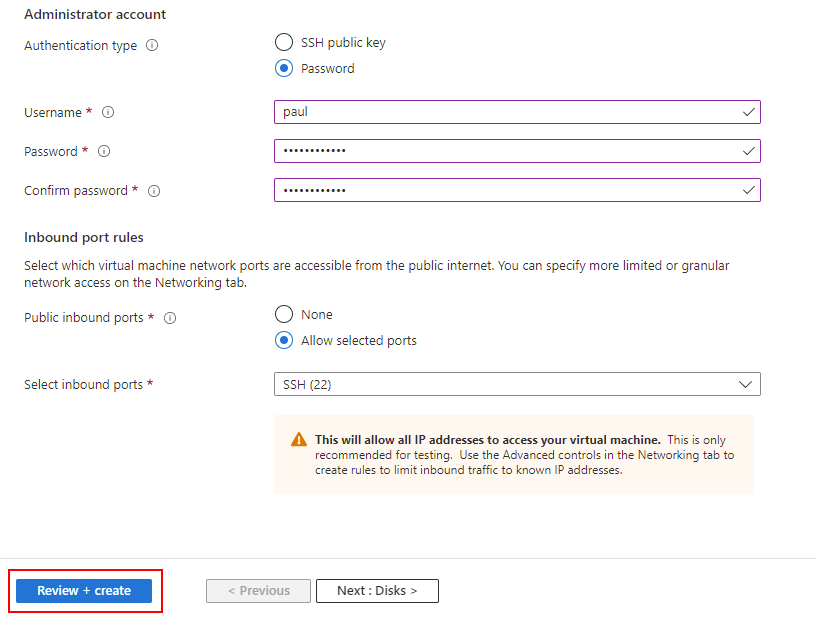
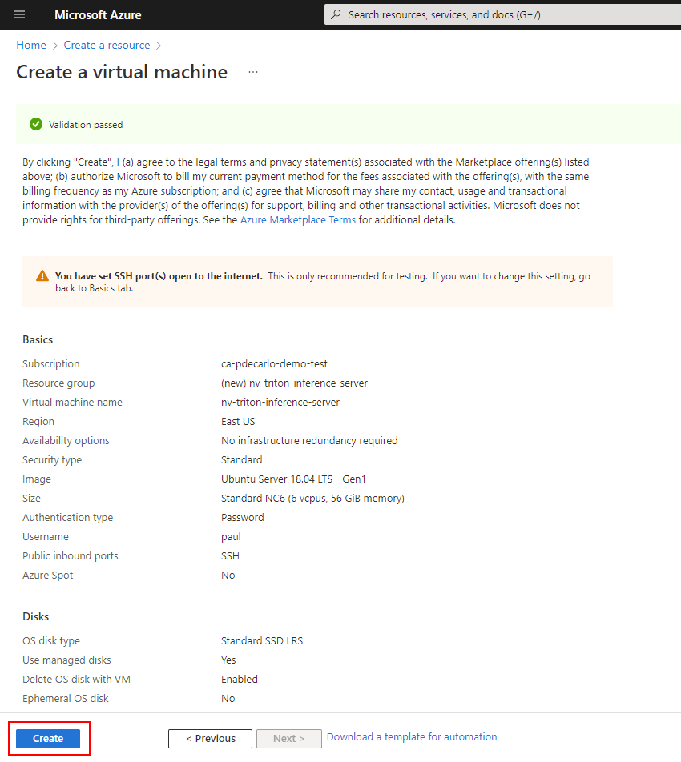
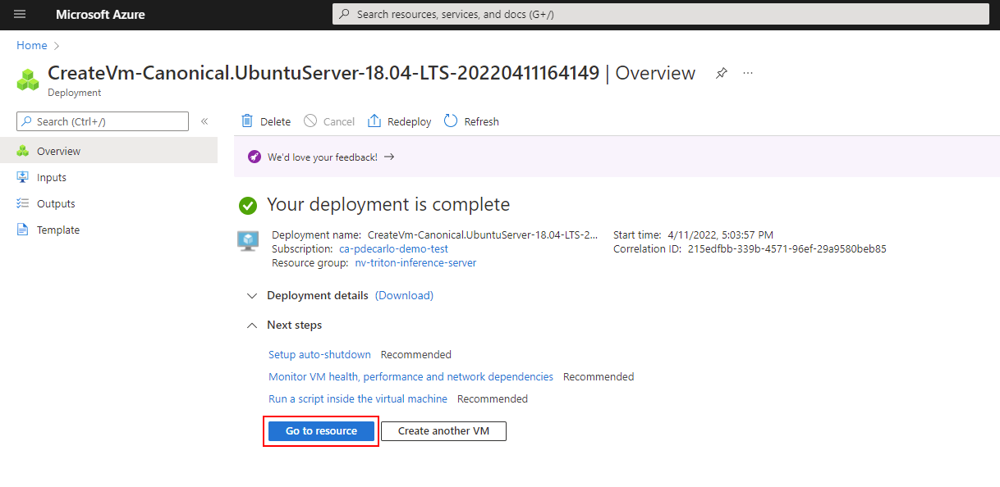
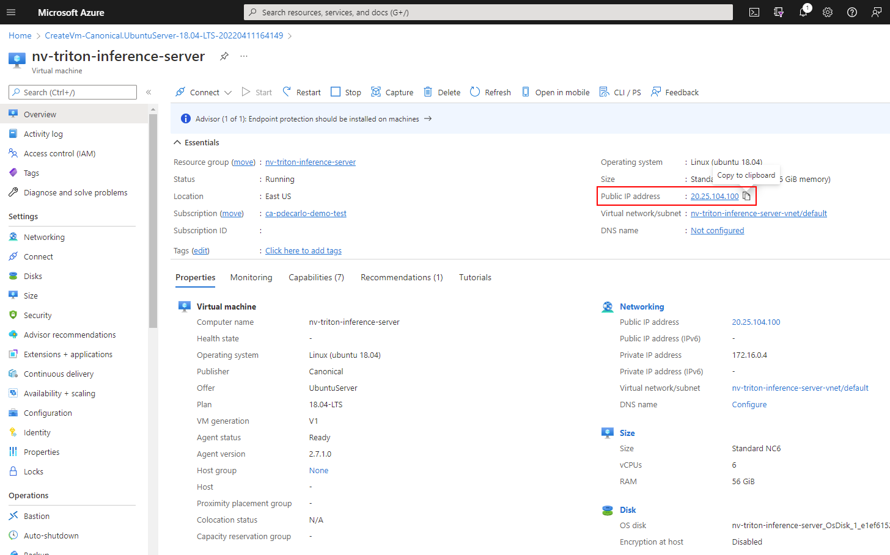

---
lab:
    title: 'Deploy Production Model'
---
## Module 14: Deploy model to NVIDIA Triton Inference Server

### Create a GPU Accelerated Virtual Machine
The Microsoft Azure cloud offers many Virtual Machine sizes with various features. [GPU optimized](https://learn.microsoft.com/en-us/azure/virtual-machines/sizes-gpu) VM sizes are specialized virtual machines available with single, multiple, or fractional GPUs. These sizes are designed for compute-intensive, graphics-intensive, and visualization workloads. In this section, we'll deploy a GPU Accelerated Virtual Machine to host an installation of the NVIDIA Triton Inference Server.

#### Create a GPU accelerated virtual machine

> [!NOTE] 
> Depending on your Azure Subscription configuration, you may not have the capability to deploy a GPU accelerated Virtual Machine. If that is the case, you may still proceed with this module by deploying any CPU based Virtual Machine.

1. Sign in to the [Azure portal](https://portal.azure.com/) and select the menu drop-down in the upper-left, then select **Create a resource**.

    

1. In the resulting screen, look for the **virtual machine section**, then select **create**.

    

1. In the **Basics** section:

	1. Create a new resource group

	1. Supply a **Virtual machine name** (must be globally unique)

	1. Choose an appropriate **Region**

	1. Leave **Availability options** as default (No infrastructure redundancy required)

	1. Leave **Security type** as default (Standard)

	1. For Image select **Configure VM generation**, then select **Generation 1** then **Apply**

        

	1. Next, select **Ubuntu Server 18.04 LTS - Gen1** in the Image section.

	1. Leave **Azure Spot instance** unchecked

	1. For **Size**, if you wish to use a CPU instance then leave this option as-is, to select a GPU accelerated offering select the **See all sizes** option.

		1. To view available GPU offerings in your subscription, select **Add filter** then select **Family**, then select only the **GPU** option and the list will update.

            

		1. Select an appropriate N-Series option under **Non-premium storage VM sizes** (**NC6** is suggested), then choose **Select**

            

	1. In the **Administrator Account** section, select **Password**

	1. The selected options at this point should look like the following.
	
        

	1. Supply a **Username** and **Password** for the Administrator Account.

	1. In the **Inbound port rules** section, select Allow selected ports, then verify that **Select inbound ports** shows **SSH (22)** is enabled.

1. The remaining options should look like the following. When you've verified your options look correct, select **Review + create**

    

	1. The resulting screen should show a Validation passed message and will present a summary of your virtual machine configuration. If everything looks good, select Create to begin the virtual machine deployment.

	    

1. The deployment will create several resources: the virtual machine, a network security group, and a public ip address. When provisioning is complete, select the Go to resource button or navigate to your virtual machine using the Azure portal.

    

1. Copy the Public IP address within the virtual machine Overview, and save this value to your text editor of choice. We'll use this value to access the virtual machine via a terminal emulator such as TeraTerm or Windows Terminal.

    
