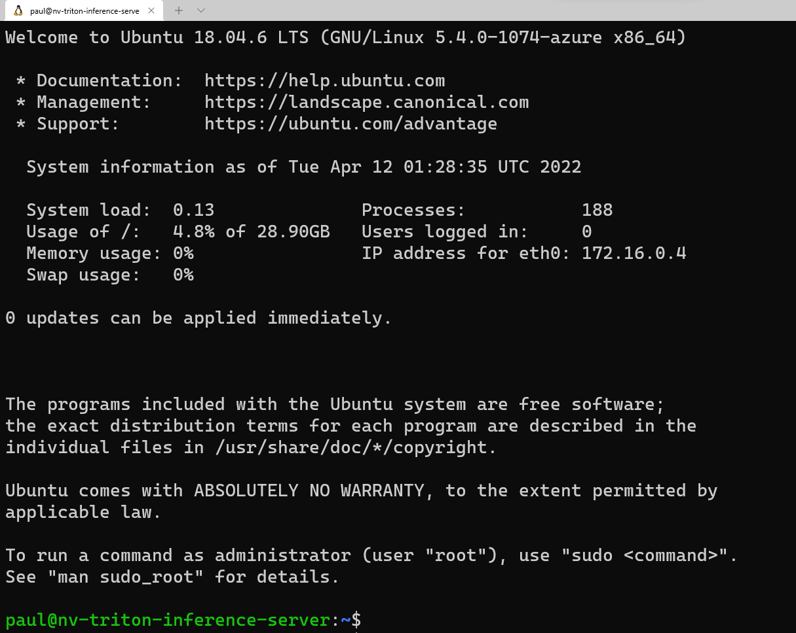
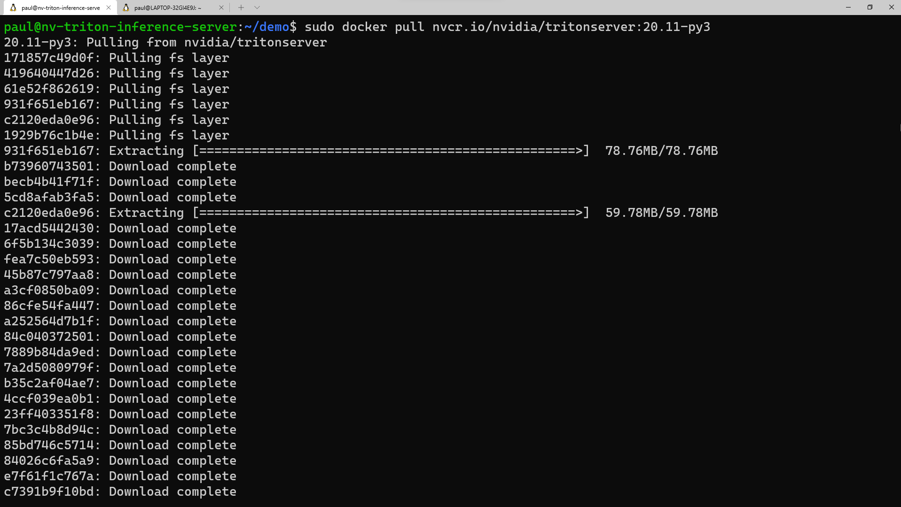
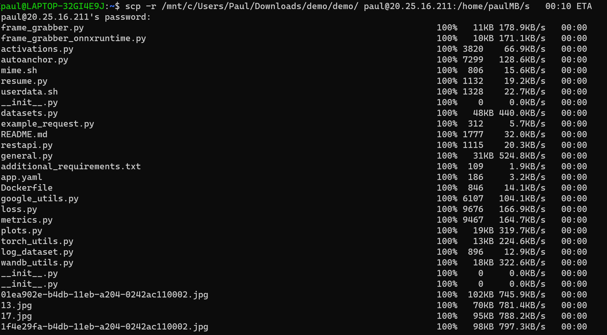
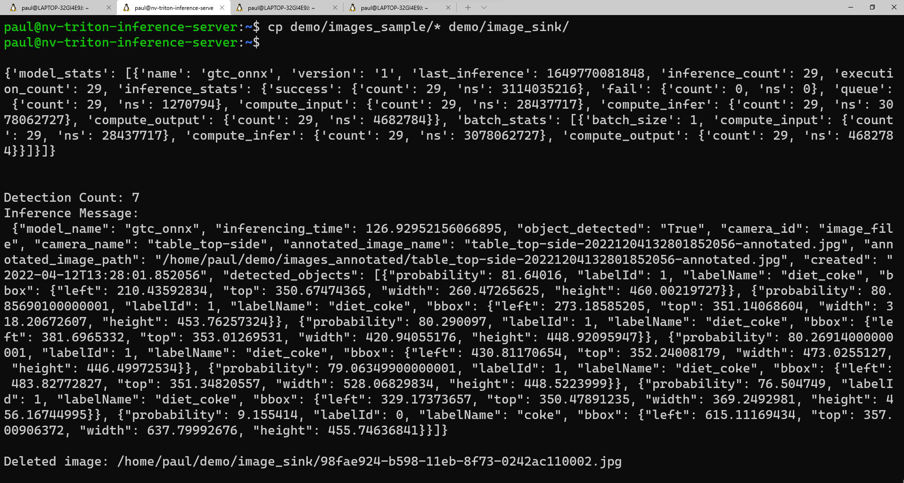

---
lab:
    title: 'Deploy Production Model'
---
## Module 14: Deploy model to NVIDIA Triton Inference Server

### Create a GPU Accelerated Virtual Machine
The Microsoft Azure cloud offers many Virtual Machine sizes with various features. [GPU optimized](https://learn.microsoft.com/en-us/azure/virtual-machines/sizes-gpu) VM sizes are specialized virtual machines available with single, multiple, or fractional GPUs. These sizes are designed for compute-intensive, graphics-intensive, and visualization workloads. In this section, we'll deploy a GPU Accelerated Virtual Machine to host an installation of the NVIDIA Triton Inference Server.

#### Create a GPU accelerated virtual machine

> **Note**
> Depending on your Azure Subscription configuration, you may not have the capability to deploy a GPU accelerated Virtual Machine. If that is the case, you may still proceed with this module by deploying any CPU based Virtual Machine.

1. Sign in to the [Azure portal](https://portal.azure.com/) and select the menu drop-down in the upper-left, then select **Create a resource**.

    

1. In the resulting screen, look for the **virtual machine section**, then select **create**.

    

1. In the **Basics** section:

	1. Create a new resource group

	1. Supply a **Virtual machine name** (must be globally unique)

	1. Choose an appropriate **Region**

	1. Leave **Availability options** as default (No infrastructure redundancy required)

	1. Leave **Security type** as default (Standard)

	1. For Image select **Configure VM generation**, then select **Generation 1** then **Apply**

        

	1. Next, select **Ubuntu Server 18.04 LTS - Gen1** in the Image section.

	1. Leave **Azure Spot instance** unchecked

	1. For **Size**, if you wish to use a CPU instance then leave this option as-is, to select a GPU accelerated offering select the **See all sizes** option.

		1. To view available GPU offerings in your subscription, select **Add filter** then select **Family**, then select only the **GPU** option and the list will update.

            

		1. Select an appropriate N-Series option under **Non-premium storage VM sizes** (**NC6** is suggested), then choose **Select**

            

	1. In the **Administrator Account** section, select **Password**

	1. The selected options at this point should look like the following.
	
        

	1. Supply a **Username** and **Password** for the Administrator Account.

	1. In the **Inbound port rules** section, select Allow selected ports, then verify that **Select inbound ports** shows **SSH (22)** is enabled.

1. The remaining options should look like the following. When you've verified your options look correct, select **Review + create**

    

	1. The resulting screen should show a Validation passed message and will present a summary of your virtual machine configuration. If everything looks good, select Create to begin the virtual machine deployment.

	    

1. The deployment will create several resources: the virtual machine, a network security group, and a public ip address. When provisioning is complete, select the Go to resource button or navigate to your virtual machine using the Azure portal.

    

1. Copy the Public IP address within the virtual machine Overview, and save this value to your text editor of choice. We'll use this value to access the virtual machine via a terminal emulator such as TeraTerm or Windows Terminal.

    

### Install prerequisites and NVIDIA Triton Inference Server
In this section, we'll access our virtual machine remotely to update the currently installed packages. We'll also install a Python development environment and configure it with prerequisite software to enable execution of the ONNX runtime. To satisfy the NVIDIA Triton Inference Server, we'll pull a container with a full installation of the tooling to allow us to execute an inference workload on our virtual machine.

#### Install prerequisites and NVIDIA Triton Inference Server
1. Open your terminal emulator of choice. For illustration, we’ll be using Windows Terminal, as it allows for multiple windows to be simultaneously connected concurrently to the virtual machine. We’ll be using one window to start the Triton Server, one window to execute a Python script and one to copy images to a directory for processing via the CLI. With Windows Terminal, you also have your choice of CLI experience, PowerShell, Command Prompt, Ubuntu-18.04 (if WSL-2 is installed) or Azure Cloud Shell.

1. Copy the username you used to set up the virtual machine in the previous stage, and in the command line run:

    ```
    ssh <username>@<your VM IP address>
    ```

1. This will prompt you for the password you saved previously to your text editor. Copy this value, and right click in the command line to paste. If logging in for the first time, you’ll see the following message:

    

1. Now we’re going to load in a few packages that our Python script will need to execute properly. On the command line, enter:

	```
	sudo apt update
	sudo apt install -y python3-pip python3-dev nano wget
	```

	Prior to installing the Python packages required, we’ll want to add ‘/home/<your username>/.local/bin’ to the PATH by taking the following steps in the CLI:

	```
	sudo nano ~/.bashrc
	```

	Arrow to the bottom of this file in the editor, and add the following line:

	```
	export PATH=/home/<your username>/.local/bin:$PATH
	```

	Press Ctrl + O and press enter to save the file, then press Ctrl + X to exit. On the command line, run:

	```
	source ~/.bashrc
	```

	This will reload the configuration for the server to include .local/bin in the PATH.

1. Now that we’ve loaded the Ubuntu package requirements and added the directory to PATH, we’re going to install the required Python packages. Copy each line individually to run in the terminal window.

	```
	python3 -m pip install --upgrade pip wheel setuptools

	python3 -m pip install numpy>=1.19.0 opencv-contrib-python-headless tritonclient geventhttpclient

	python3 -m pip install

	torch torchvision pandas tqdm PyYAML scipy seaborn requests pybind11 pytest protobuf objdict onnxruntime
	```

	If you're using a Nvidia GPU-capable VM, you can use onnxruntime-gpu instead of onnxruntime to take advantage of the CUDA/cuDNN acceleration.

1. To run the Triton Server container from Nvidia, we’re going to need a container engine. Microsoft has a distribution of this container runtime, which can be installed using the following commands:

	```
	wget https://packages.microsoft.com/config/ubuntu/18.04/multiarch/packages-microsoft-prod.deb -O packages-microsoft-prod.deb

	sudo dpkg -i packages-microsoft-prod.deb

	rm packages-microsoft-prod.deb
	```

	Now we can install Moby:

	'''
	sudo apt update

	sudo apt install -y moby-engine

	sudo apt update
	'''

1. Now, we’re ready to pull the container for the Triton Server from the NVIDIA NGC repository. You can also pull the container during the 'docker run' command when we get to that step, but for simplicity, we'll do the pull now. In the terminal emulator, run:

	```
	sudo docker pull nvcr.io/nvidia/tritonserver:20.11-py3
	```

	This process will take some time to download the container layers and extract them.

	

1. Now we’re ready to copy the 'demo' directory over to the virtual machine. Download the [demo.zip](https://github.com/microsoft/Develop-Custom-Object-Detection-Models-with-NVIDIA-and-Azure-ML-Studio/raw/main/demo.zip) file from the repository, then unzip this file locally on your PC. Open a command prompt window, either in the utility, or open another window in Windows Terminal. Depending on where you unzipped the files, run the following command in the CLI:

	```
	scp -r <path to unzipped>/demo <your username>@<x.x.x.x vm IP address>:/home/<your username>/
	```

	

1. Once we have these files copied over to the virtual machine, let’s switch back over to the terminal window connected to the virtual machine and set the permissions for this directory. In the CLI, enter:

	```
	sudo chmod -R 777 demo
	```

### Execute inference workload on NVIDIA Triton Inference Server
Now we’re ready to run the example Python script on the Triton Server. If you look in the ‘demo’ directory, you’ll see a collection of folders and files.

In the 'demo/app' folder, there are two Python scripts – 'frame_grabber.py' that uses the Triton Inference Server, and 'frame_grabber_onnxruntime.py' that can be used standalone. The 'utils' folder inside of the 'app' directory contains Python scripts to enable the interpretation of the model’s output tensor.

Both Python scripts are set to watch the 'image_sink; directory for any image files that are placed there. In the 'images-sample', you’ll find a collection of images that we'll copy via command line to the 'image_sink' for processing. The Python scripts automatically delete the files from the 'image_sink' after the inference has been completed.

In the 'model-repo' folder, you’ll find a folder for the name of the model (gtc_onnx), which holds the model configuration file for the Triton Inference server, and the label file. Also included is a folder denoting the version of the model, which contains the ONNX model that the server uses to inference.

If the model detects the objects it was trained on, the Python script will create an annotation of that inference with a bounding box, tag name and confidence sore. The script saves the image into the 'images-annotated' folder, using a unique name using a timestamp, which we can download to view locally. That way, you can copy the same images over and over again to the 'image_sink' but have new annotated images created each run for illustration purposes.

#### Execute an inference workload on NVIDIA Triton Inference Server
1. To get started on the inferencing, we’ll want to open two windows in the Windows Terminal, and ssh into the virtual machine from each window.

1. In the first window, run the following command, but first change out the *username* place holder with your username for the virtual machine:

	```
	sudo docker run --shm-size=1g --ulimit memlock=-1 --ulimit stack=67108864 --rm -p8000:8000 -p8002:8002 -v/home/<your username>/demo/model-repo:/models nvcr.io/nvidia/tritonserver:20.11-py3 tritonserver --model-repository=/models
	```

1. In the second window, copy the following command, changing <your username> to your value, and set the <probability threshold> to your desired confidence level between 0 and 1 (by default, this value is set to 0.6)

	```
	python3 demo/app/frame_grabber.py -u <your username> -p .07
	```

1. In the third window, copy and paste this command to copy the image files from the 'images_sample' folder to the 'image_sink' folder:

	```
	cp demo/images_sample/* demo/image_sink/
	```

	If you go back to your second window, you can see the execution of the model, including the model statistics and the returned inference in the form of a Python dictionary.

	Here's a sample view of what you should see in the second window as the script executes:

	

1. If you want to see a list of your annotated images, you can run this command:

	```
	ls demo/annotated_images
	```

1. To download the images to your local machine, we’ll first want to create a folder to receive the images. In a command line window, 'cd' to the directory you to place the new folder in, and run:

	```
	mkdir annotated_img_download
	scp <your usename>@x.x.x.x:/home/<your username>/demo/images_annotated/* annotated_img_download/
	```

	This command will copy all of the files from the Ubuntu virtual machine to your local device for viewing.
